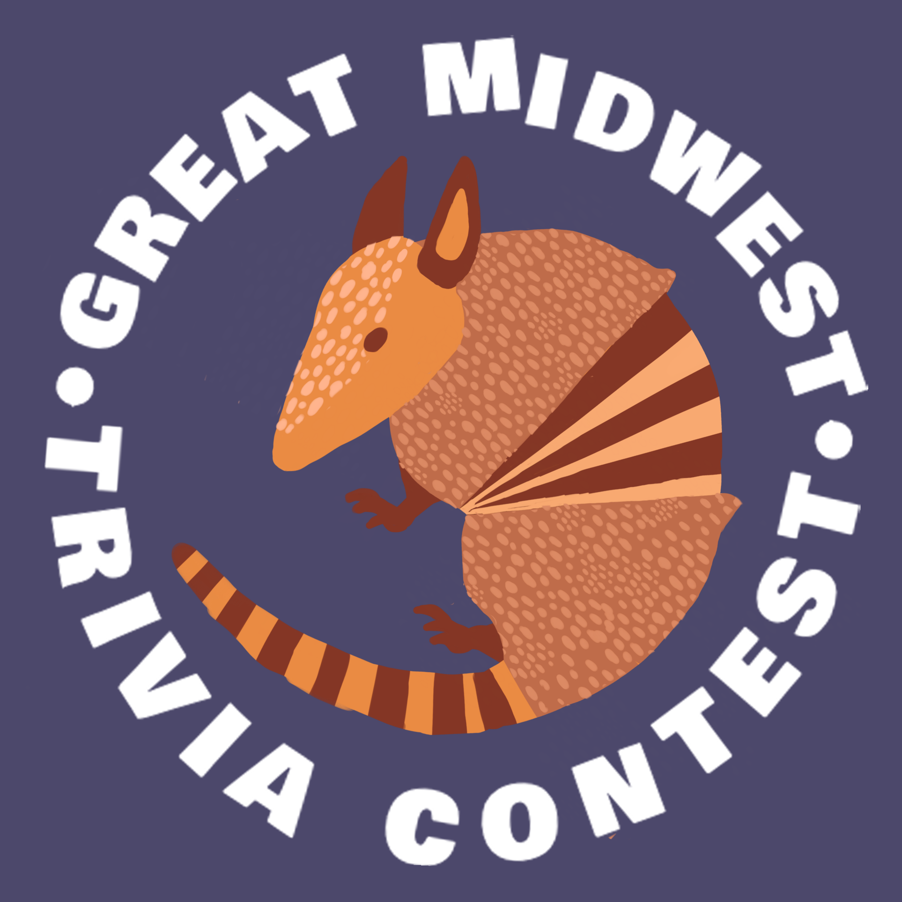

    

<h1 align="center">
GMTC OperatorBot
</h1>

The OperatorBot for the 2021 Great Midwest Trivia Contest!

Read more about the GMTC here: blogs.lawrence.edu/trivia

Watch Trivia live here: https://www.twitch.tv/greatmidwesttrivia

The bot acts as an "Operator" for Discord - trivia players can join the "waiting
room" voice channel. The bot places these players "in queue", and tracks their
position.
